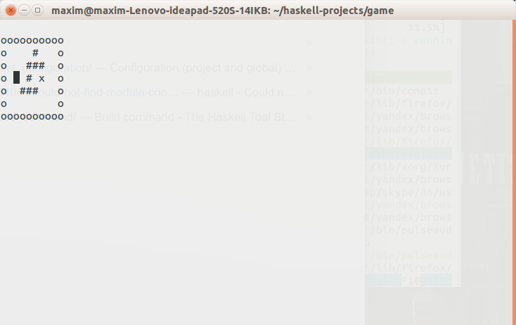

### A very simple game in haskell

The goal of this game is to reach `x`.

But one loses if goes to `o`. 



### Prepare

This lines should install install the dependencies.

Stack is a package for haskell, btw.  

```bash
curl -sSL https://get.haskellstack.org/ | sh
sudo apt install ncurses-dev libncurses5-dev libncursesw5-dev

stack install mtl
stack install vector
stack install ncurses
stack install exceptions
```

### Run
1. `stack repl --package mtl --package ncurses --package vector --package exceptions`
2. `main`

(I know that this way of running is screwed, of course. If you know how to configure this project tell me.)

